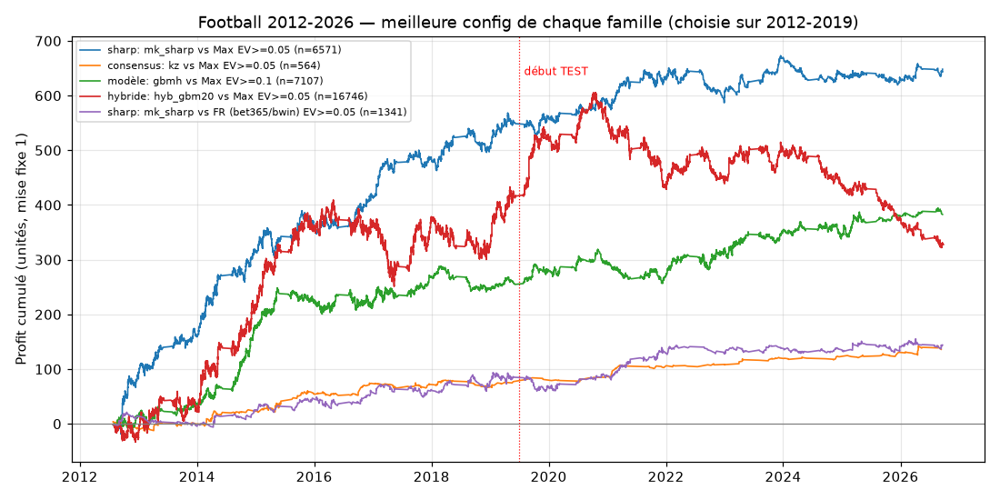

# Résultats — football (22 championnats principaux + 16 championnats extra)

> Données : football-data.co.uk, 192 143 matchs (2000-2026) dans 22 championnats
> (Angleterre ×5, Écosse ×4, Allemagne ×2, Italie ×2, Espagne ×2, France ×2, Pays-Bas,
> Belgique, Portugal, Turquie, Grèce) + 63 341 matchs dans 16 championnats « extra ».
> Protocole : [05_methodologie.md](05_methodologie.md). Toutes les tables :
> [resultats/football.md](resultats/football.md). Scripts : `scripts/football_pipeline.py`,
> `scripts/football_strategies.py`, `scripts/football_extra_leagues.py`.
> **330 configurations 1N2 et 37 Over/Under ont été testées** : gardez les tests multiples en tête.

## 1. Les modèles ne battent pas le marché

RPS sur les mêmes matchs (plus bas = meilleur) :

| Modèle | dev 2012-2019 (52 177 matchs) | test 2019-2026 (48 394 matchs) |
|---|---|---|
| Pi-ratings | 0,2102 | 0,2098 |
| Dixon-Coles (hebdomadaire) | 0,2098 | 0,2099 |
| Elo + logit ordonné | 0,2096 | 0,2093 |
| LightGBM (stats de match, sans cotes) | 0,2086 | 0,2076 |
| LightGBM hybride (+ cotes moyennes) | 0,2052 | 0,2043 |
| Marché : moyenne des bookmakers (ouverture) | 0,2047 | 0,2041 |
| Marché : Pinnacle ouverture | 0,2047 | 0,2041 |
| **Marché : Pinnacle clôture** | **0,2038** | **0,2030** |

- Le meilleur modèle « pur » (LightGBM sur Elo, pi-ratings, Dixon-Coles et forme EWMA
  des tirs/buts/corners) reste à **+0,0035 de RPS** du marché d'ouverture. C'est
  l'ordre de grandeur observé dans la littérature (Baboota & Kaur 2019 : 0,2156 contre
  0,2012 pour les bookmakers en Premier League).
- Ajouter les cotes au modèle (hybride) le ramène **au niveau** du marché, pas au-dessus.
- C'est vrai dans **chaque** championnat (voir tableau par championnat dans les résultats
  bruts).

Conséquence : parier avec ces modèles contre les cotes perd de l'argent.

| Modèle (value EV ≥ 2-10 %) | contre cote moyenne | contre bet365/bwin | contre la meilleure cote |
|---|---|---|---|
| Dixon-Coles | −10,5 % | −8,5 % | −5,5 % |
| Elo | −9,8 % | −8,4 % | −4,6 % |
| Pi-ratings | −9,3 % | −7,2 % | −4,1 % |
| LightGBM | −7,6 % | −5,3 % | −2,4 % |

(ROI moyen sur la période test, mise fixe ; CLV systématiquement négative.)

## 2. Over/Under 2.5 : même verdict

- Dixon-Coles Over/Under contre bet365 : **−5,7 % à −5,9 %** en test (≈ 11 000 à 29 000 paris selon le seuil).
- LightGBM Over/Under : −4,7 % à −7,1 % (bet365), −1,7 % à −2,6 % (meilleure cote).
- **L'ancien système rejoué proprement** (Over seul, edge ≥ 5 points, cotes bet365) :
  **−3,0 %** sur 4 445 paris (IC 95 % −5,7 % à −0,1 %).
- Seule exception : cote juste Pinnacle Over/Under contre meilleure cote, EV > 2 % :
  +3,4 % (IC +0,1 à +6,9 %, n = 2 879, 2019-2026 seulement).

## 3. Ce qui gagne : comparer les cotes à une référence sharp

### 3.1 Pinnacle (ouverture) sans marge vs meilleure cote — choisie sur dev, EV ≥ 5 %, cote ≤ 10

| | n | ROI | IC 95 % | CLV |
|---|---|---|---|---|
| dev 2012-2019 | 4 224 | **+13,0 %** | [+7,7 ; +18,3] | +5,9 % |
| test 2019-2026 | 2 347 | +4,2 % | [−2,8 ; +11,1] | +3,6 % |

- Positif **13 saisons sur 15** et dans **18 championnats sur 22** ; CLV positive partout.

- **Mais l'avantage s'érode** : ≈ +20 % en 2012-2013, ≈ +3 à +5 % en 2024-2025 (voir
  `results/football/profit_cumule_familles.png`). En test, le résultat n'est plus
  significatif (p = 0,13).

### 3.2 Échantillon indépendant : 16 championnats extra (clôture Pinnacle vs meilleure cote de clôture)

| EV | 2012-2018 | 2019-2026 |
|---|---|---|
| > 0 % | +3,0 % (n = 25 777, IC +1,1/+4,9) | +3,6 % (n = 23 995, IC +1,7/+5,3) |
| > 2 % | +4,0 % (n = 17 640) | **+5,8 %** (n = 13 311, IC +3,1/+8,6) |
| > 5 % | +5,8 % (n = 8 648) | +8,6 % (n = 5 286, IC +3,9/+13,2) |

Positif dans 14 championnats sur 16. C'est le résultat le plus solide du projet (des
dizaines de milliers de paris, deux périodes, p < 0,001), cohérent avec Kaunitz et al.
(2017) et le tennis.

### 3.3 Consensus du marché (Kaunitz et al.) vs meilleure cote

| Variante (choisie sur dev) | dev | test |
|---|---|---|
| moyenne sans marge, EV ≥ 5 %, cote ≤ 3,5 | +15,5 % (n = 883) | **+17,2 %** (n = 327, IC +3,4/+31,2) |
| 1/cote moyenne − 0,034, EV ≥ 5 %, cote ≤ 10 | +18,8 % (n = 410) | +38,4 % (n = 154, IC +12,9/+63,6) |
| moyenne sans marge, EV ≥ 0 %, cote ≤ 3,5 | +1,3 % (n = 28 790) | +2,4 % (n = 19 336, IC +1,0/+3,9) |

Les ROI très élevés portent sur peu de paris et s'expliquent en partie par des cotes
« Max » aberrantes ou périmées (voir autocritique). La variante à EV ≥ 0 %, beaucoup plus
volumineuse, donne l'ordre de grandeur réaliste : **+1 à +3 %**.

### 3.4 Et avec les seuls bookmakers agréés en France ?

Proxy « FR » = meilleure cote entre bet365 et bwin (agréés ANJ ; cotes .com, pas .fr) :

| Variante | dev | test |
|---|---|---|
| Pinnacle juste vs FR, EV ≥ 2 %, cote ≤ 3,5 | +0,4 % (n = 1 746) | +7,6 % (n = 1 450, IC +0,5/+14,9) |
| Pinnacle juste vs FR, EV ≥ 5 %, cote ≤ 10 | +12,6 % (n = 678) | +8,9 % (n = 663, p = 0,10) |
| Consensus vs FR, EV ≥ 0 %, cote ≤ 3,5 | −1,1 % (n = 3 293) | +5,7 % (n = 1 905, IC +0,5/+11,3) |
| Betfair juste vs FR (2024-2026) | — | +3,5 % (n = 1 354, non significatif) |

**Lecture honnête** : avec deux bookmakers seulement, il y a peu de paris et les
résultats sont instables (≈ 0 sur une période, positif sur l'autre). L'avantage
robuste suppose de comparer **beaucoup** de bookmakers. En France, cela signifie avoir
des comptes chez plusieurs des 16 opérateurs agréés.

### 3.5 Un modèle qui gagne quand même ? LightGBM hybride vs meilleure cote

LightGBM hybride (stats + probabilités du marché moyen), EV ≥ 5 %, cote ≤ 3,5 :
dev **+3,0 %** (n = 14 986, IC +0,9/+5,0), test **+4,8 %** (n = 11 456, IC +2,4/+7,4).
Positif sur les deux périodes, mais sa CLV est faible (+1 %) et il ne gagne **pas**
contre la cote moyenne ou Pinnacle. Interprétation : il apprend surtout à repérer quand
la meilleure cote s'écarte du consensus (même mécanisme que 3.3). À considérer comme une
variante de S01/S02, pas comme la preuve qu'un modèle prédit mieux que le marché.

## 4. Biais du marché (tous les paris d'une catégorie, 2012-2026, ~100 000 matchs)

| Cotes utilisées | Domicile | Nul | Extérieur |
|---|---|---|---|
| Moyenne des bookmakers | −6,3 % | −7,3 % | −10,1 % |
| bet365 | −6,0 % | −6,0 % | −8,6 % |
| Pinnacle clôture | −3,4 % | −3,4 % | −5,2 % |
| Meilleure cote | −1,5 % | −1,4 % | −3,1 % |

- Les **outsiders** (cote > 10) perdent 15 à 37 % : biais favori/outsider net.
- Aucun « parier tous les nuls / tous les favoris / tous les domiciles » n'est rentable.
- La marge moyenne varie de 4,6 % (Premier League) à 7,8 % (Grèce).

## 5. Gestion de mise (stratégie 3.1, période test, mise ≤ 100 €)

| Gestion | ROI | Bankroll finale (1 000 € au départ) | Drawdown max |
|---|---|---|---|
| Mise fixe 1 % | +4,2 % | 1 995 € | 31 % |
| Kelly 1/10 | +7,3 % | 1 848 € | 17 % |
| **Kelly ¼** | +6,9 % | 3 899 € | 39 % |
| Kelly ½ | +5,2 % | 6 799 € | 56 % |
| Kelly complet | +4,3 % | 9 545 € | 57 % |

## 6. Conclusion football

1. Aucun modèle statistique testé ne bat le marché ; ils ne doivent pas servir à parier seuls.
2. La comparaison « cote juste sharp vs meilleure cote » gagne, de façon très
   significative sur l'échantillon indépendant, mais **l'avantage diminue d'année en
   année** dans les grands championnats.
3. Les championnats moins suivis (extra, divisions inférieures) gardent plus d'écarts.
4. Pour un parieur français, le facteur limitant est le **nombre de bookmakers**
   comparés, pas le modèle.
